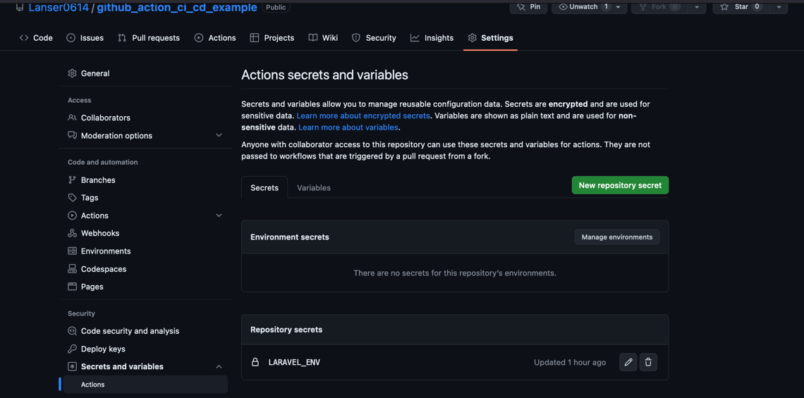

simple GiHub CI CD

edit deployment-config.json file with 
your valid data and add secret variables for
your .env file hire

click button "New repository secret"

insert name for example "LARAVEL_ENV"
and into Secret option copy your valid 
.env file and insert into input.
After that you can use CI CD in your 
Laravel application
